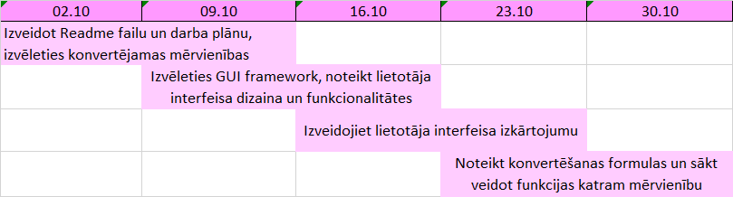

# python.project
# Unit Converter
Lietotne mērvienību konvertēšanai, lai atvieglotu aprēķinus. Lietotājam būs jāievada sākotnejie dati un vēlamo mērvienību. Plānots, ka būs pieejamas garuma, laukuma, blīvuma, masas, ātruma un temperatūras mērvienības. 

Grupas sastāvs: Valerija

Darba plans 02.10-30.10

Darba plans 13.11-17.12

